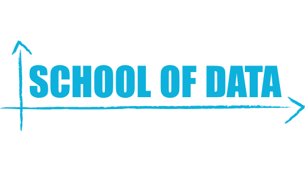

# R 4 Data-driven Journalism (DDJ)
#### School of Data Pre-event Training
###### Facilitator: David Selassie Opoku, School of Data & Open Knowledge (@sdopoku)

# R4DDJ

R is a powerful statistic and graphics language and environment used by many individuals and organisations in their day-to-day work with data. In this short training, we explore what doing **data-driven journalism (DDJ)** is, why R is a great tool for the modern data journalists, and get started learning key features of R for doing data-driven journalism. At the end of the session, participants should:

- Have a definition of what data-driven journalism is
- Know what the process for doing data-driven journalism looks like.
- Learn about the Data Pipeline used by School of Data.
- Set up RStudio and be familiar with some features
- Know some useful R commands for DDJ
- Explore the ggplot2 package
- Know where to go for a deeper dive into R 4 DDJ.

## Outline

### Part 1
- Milestone 1
  - Define data-driven journalism (DDJ)
  - Outline DDJ process
  - Outline the Data Pipeline
  - Explore why data journalists should care about R.
  - References

- Milestone 2
  - Set up RStudio on local devices
  - Set up RStudio with a cloud service [RollApp](www.rollapp.com)
  - Explore the RStudio environment and key features.
  - Introduce some key R functions for DDJ.
  - References

### Part 2
- Milestone 3
  - Concept of Grammar of Graphics.
  - Introduction to **ggplot2**.
  - Some graphs with ggplot2.
  - References

# Part 1
### Milestone 1:  DDJ <> R - a relationship meant to be ?

#### What is DDJ ?
- **TO DO**: Define data-driven journalism (DDJ)

#### DDJ Process
- **TO DO**: Outline DDJ process

#### Data Pipeline

- **TO DO**: Outline the Data Pipeline

#### DDJ + R = ?
- **TO DO**: Explore why data journalists should care about R.

#### References
- **TO DO**: A list of DDJ and R references

## Milestone 2: Kicking off with R in the Studio.

R is a powerful

#### Downloading & Setup
  - Download R from CRAN website
  - Download RStudio IDE from [RStudio website](https://cran.r-project.org/)

  - **Exercise 1**: Setup  RStudio on Your Computer
    1. Go to [CRAN website](https://cran.r-project.org/), download your version of R and get it installed on your computer.
    - Go to [RStudio website](http://www.rstudio.com), download your version of RStudio IDE and get it installed on your computer.

#### Getting Familiar with RStudio
  RStudio is a powerful Integrated Development Environment(IDE) that provides a convenient environment to run R-related tasks and projects easily. I will briefly review some of the keys features of RStudio but see this [cheatsheet](http://www.rstudio.com/wp-content/uploads/2016/01/rstudio-IDE-cheatsheet.pdf) for more details.
  - Menus
  - Panes/Windows
    - Source Editor
    - Console
  - Help

  - **Exercise 2**:
    1. Create a new R Project

#### Some Basic R Commands
  - **Data Containers & Formats**: vector, matrix, array, data frame, list, factors.
  - **Functions**: str, length, dim, names, summary, ls, help/?, read.csv, table, View etc.

### Part 2: Getting Hands-on

#### Working Dataset: Ghana Health Facilities Dataset
#### The Power of R Packages
#### Building Your Data Pipeline
At School of Data, we like to think about the data analysis process as a pipeline. Below is a framework we usually use:

#### References & Resources
  - [RStudio Visualisation with ggplot2 cheatsheet](http://www.rstudio.com/wp-content/uploads/2015/12/ggplot2-cheatsheet-2.0.pdf)
  - [R Project](https://www.r-project.org/)
  - [Datacamp](https://www.datacamp.com/)
  - Hadley Wickham: follow on Twitter, @hadleywichkam
  - [R-bloggers](http://www.r-bloggers.com/)
  - [Flowing Data Website](www.flowingdata.com)
